# **EyeToI**
### **🚩 프로젝트의 목적 및 용도** ###
---
Image Detection을 이용한 시각장애인들이 실시간 보행 시 장애물의 종류와 이동거리를 알려주는 시스템입니다. POI 서비스도 제공하여 카메라를 사용하지 못하거나 처음 가보는 곳에 진입했을 시에도 축적된 데이터들을 기반으로 장애물을 안내합니다.

 

### **개발 환경 및 개발 도구** ###
---
**1. 개발 환경**
- Window 10, Mac OS

**2. 개발 도구**
- Android : Android Studio
- AI : Tensorflow

**3. 개발 언어**
- Android : JAVA
- Web Server : JSP

 

### **개발상세** ###
---

#### **1. 시스템 구성 및 아키텍처** ####

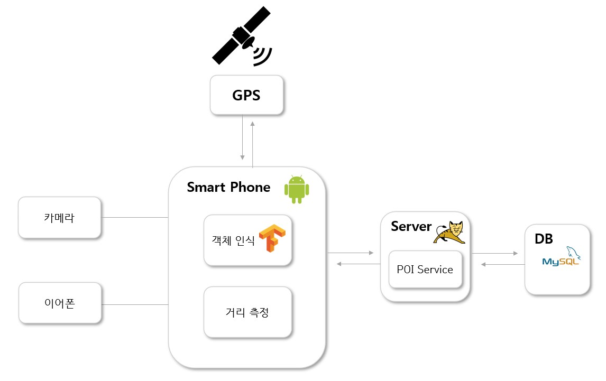

안드로이드 스마트폰 환경에서 구동하는 **앱** 형태이다.  
객체를 사용하는 모듈은 **카메라와 이어폰**이다.  
객체 인식을 위한 모델은 SSD MobileNet를 사용하여 완성된 모델을 .tflite 로 변환, 안드로이드 내에서 제공하는 TensorflowLite로 Object detection을 수행한다. 
거리 측정은 내부에 Java 코드로 작성되었다.  
PoI Service는 Tomcat 기반 웹서버에서 제공되며, 기기에서 GPS 통신을 통해 수신하는 위치 정보를 MySQL DB에 CRUD를 이용하여 저장/수신이 가능하다.

 

#### **2. 시스템 Flow Chart** ####
- 시스템 프로세스
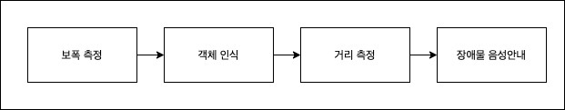
- 객체인식 및 안내 프로세스
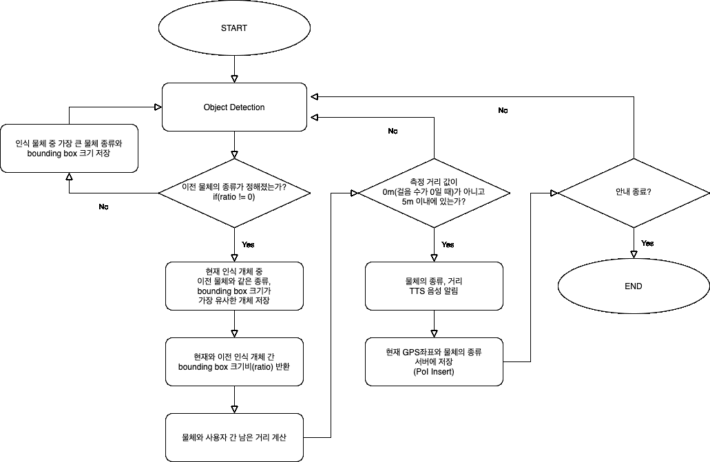
- POI 프로세스
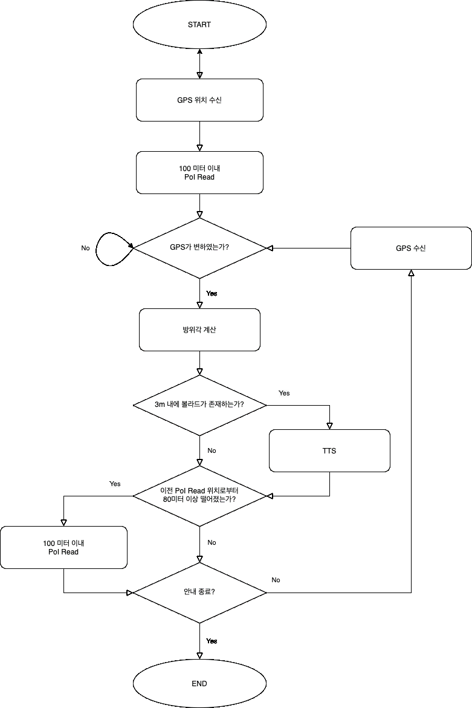

 

#### **3. 프로젝트 주요 기능** ####
**3.1. 보폭측정**  
가속도 센서의 세 방향 벡터를 입력 받고 고주파 필터링을 거쳐 중력값을 제거한다. 그 후 저주파 필터링을 거쳐 노이즈 값을 제거한다. 한 걸음 단위의 데이터가 쌓였다면 Weinberg Approach 방법을 사용하여 보폭을 측정한다.

**3.2.거리측정** 
3.2.1. 타깃 지정  
 가장 처음 물체를 인식 할 때,  감지된 물체 중 bounding box의 크기가 가장 큰 것을 지정하고 종류와 크기를 저장한다. 
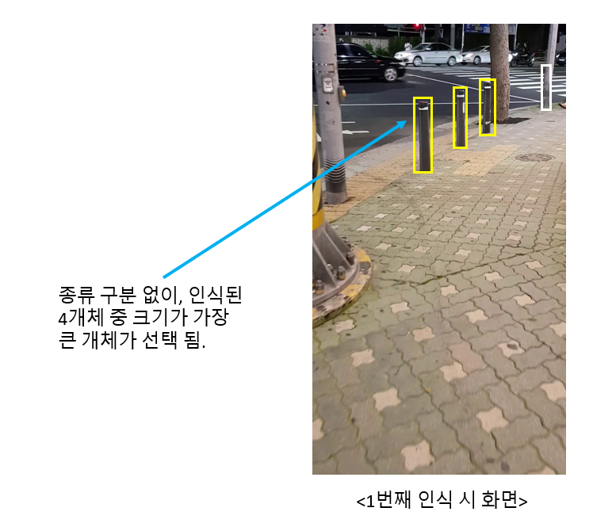

3.2.2 비교 대상 지정 - 종류 선별  
타깃 지정 후, 비교 대상 지정을 위한 첫 단계로서 타깃과 동 종류 사물만 걸러낸다. 
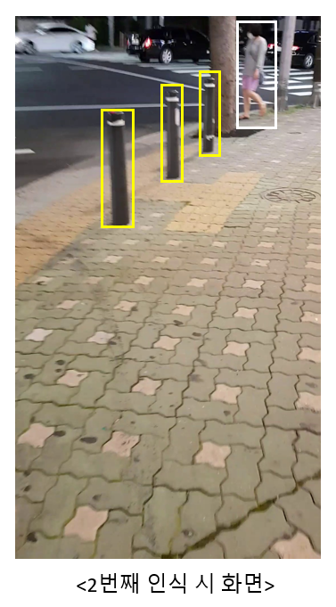
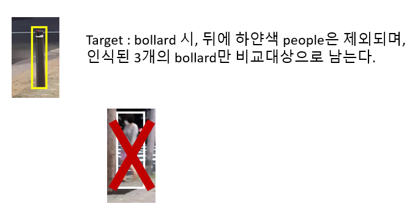

3.2.3 비교 대상 지정 - 크기 선별  
같은 종류의 대상 중, 타깃의 bounding box와 크기 차이가 가장 유사한 대상을 단일 지정한다.

3.2.4 거리 측정 근거 - 거리와 상크기의 관계 

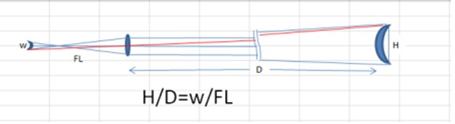
 
FL1 = FL2, H1 = H2 일 때(카메라 환경과 실제 크기에 변함이 없을 때) 두 식을 연립하여 D1/D2 = W2/W1 의 식을 얻을 수 있으며, 카메라로 관측할 때, 관측자와 물체까지의 거리와  카메라에 맺힌 상의 크기(bounding box 크기)비는 반비례함을 알 수 있다. 
 
3.2.5 거리 측정 근거 - 이동거리와 상 크기를 통한 목표물까지의 거리 계산

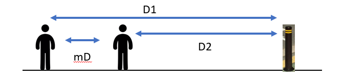
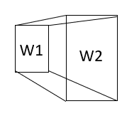 
Android 상에 제공되는 부팅 후 걸음 수를 측정하는 TYPE_STEP_COUNTER 동작 센서를 이용하여 cur_step – old_step = moved_step(이동한 걸음 수)를 구할 수 있다. 이를 보폭 측정 과정에서 구한 보폭(step_length)와 곱해주면 step_length × moved_step = mD(movedDistance)로 실제 이동거리 mD를 구할 수 있다. 

거리와 상 크기의 관계 D1/D2 = √R2/√R1 일 때, 이전 관측자와 물체간의 거리(D1)과 이후 관측자와 물체간의 거리(D2)의 차를 mD = (D1-D2), D1/(D1-mD) = √R2/√R1 or (D2+mD)/D2 = √R2/√R1으로 표현 가능하며, mD(실제 이동거리), √R1 (타깃 bounding box 크기 제곱근), √R2 (이동 후 타깃 bounding box 크기 제곱근) 를 대입하여 D1과 D2를 산출할 수 있다. 

3.2.6 이동방향(앞,뒤)에 따른 계산식, 음성알림 
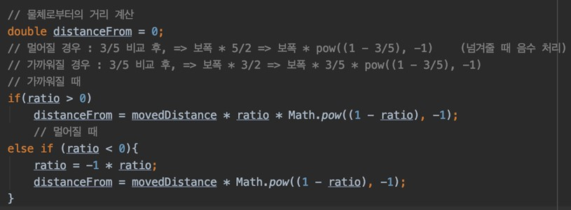
물체에 가까워질 때, 물체로부터 멀어질 때 계산식을 달리하여 정확한 거리를 산출한다. 이를 Android TTS로 음성 알림 해준다.

 

### **사용 예제 동영상** ###
---
https://www.youtube.com/watch?v=tDwh9wUuaus

<iframe width="560" height="315" src="https://www.youtube.com/embed/tDwh9wUuaus" title="YouTube video player" frameborder="0" allow="accelerometer; autoplay; clipboard-write; encrypted-media; gyroscope; picture-in-picture" allowfullscreen></iframe>

 
 

### **외부 리소스 정보** ###
---
- Tensorflow lite : 
- 보폭 측정 방법 : https://github.com/tagynedlrb/2018.6.5_Indoor-Location-and-Path-Prediction-System

 

### **라이선스** ###
---
